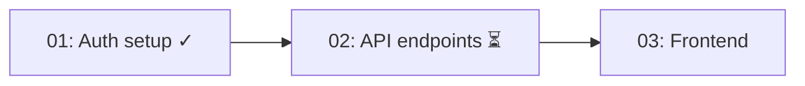

# Design Status

Read-only overview of a design and all its stories. Shows progress, blockers, and dependency graph.

## Variables

- **FIND_DOC**: `${CLAUDE_PLUGIN_ROOT}/scripts/find-doc.sh`
- **QUERY_STORIES**: `${CLAUDE_PLUGIN_ROOT}/scripts/query-stories.sh`

## User Input
```
$ARGUMENTS
```

Parse for design file path, name, or ID.

## Process

### 1. Find Design

Use FIND_DOC to locate the design:

```bash
bash FIND_DOC design "<user input>"
```

If no input, list available designs and let user pick.

Read the design document.

### 2. Query Stories

```bash
bash QUERY_STORIES --design <design-id>
```

Read each story file to get full details.

### 3. Build Status Report

Generate a status report:

```
# Design: <title>
Status: <status>
Created: <date>

## Summary
<design description or first paragraph of Problem Context>

## Key Decisions
<bullet list from Architecture Decisions, max 5>

## Stories

| ID | Title | Status | Progress | Blocked By |
|----|-------|--------|----------|------------|
| 01 | Auth setup | done | 5/5 | — |
| 02 | API endpoints | in-progress | 2/4 | — |
| 03 | Frontend | ready | 0/3 | 02 |

Progress: 1/3 stories done, 7/12 tasks complete

## Dependency Graph



## Blockers
<any stories with unresolved blocked-by, or blockers from dev logs>

## Recent Activity
<last 3 dev log entries across stories, with dates if available>
```

### 4. Suggest Actions

Based on status:

- **Has actionable stories**: "Next: `/develop-story <id>` for <title>"
- **All stories done**: "All stories complete. Run `/design-update` to finalize, then `/design-archive`"
- **Has blockers**: "Blocked stories need attention. Consider `/design-update` to reassess."
- **No stories**: "No stories yet. Run `/design-expand` to break down the design."

## Guidelines

- Read-only — does not modify any documents
- Keep the overview scannable — summarize, don't dump full content
- Mermaid graph shows dependency flow, marks done (✓) and in-progress (⏳)
- Progress counts completed tasks across all stories
