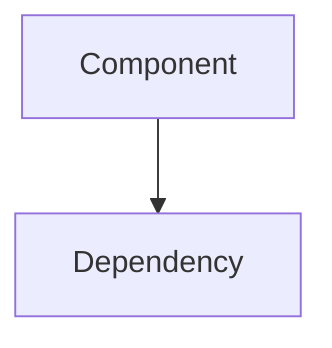

# Ticket Template

Structure for discovery tickets stored at `.discovery/tickets/<id>-<slug>.md`.

## Frontmatter

```yaml
title: <short descriptive title>
type: discovery-ticket
tags: [<relevant tags>]
scope: <one-line scope description or glob pattern>
id: t-NNNN
status: open
parents: [t-NNNN]
related: [t-NNNN]
intention: <why this ticket exists — the question or goal>
created: <YYYY-MM-DD>
updated: <YYYY-MM-DD>
```

### Field Notes

- **id**: Auto-generated by CLI via `discover ticket next-id`
- **status**: `open` → `active` → `done` (or `dropped`, `blocked`)
- **type**: `discovery-ticket` (default) or `doc-reference` (for external docs)
- **parents**: Links to tickets this one was spawned from
- **related**: Links to tickets discovered during investigation
- **intention**: The driving question — what we're trying to learn
- **refs**: (doc-reference only) Paths to external docs this ticket represents

### Doc-Reference Tickets

Use `type: doc-reference` to bring external documentation into the knowledge graph:

```yaml
title: "ARCHITECTURE.md coverage"
type: doc-reference
refs: [docs/ARCHITECTURE.md]
intention: "What does this doc cover? What's missing?"
status: done
```

- The ticket summarizes what the doc covers in Findings
- Gaps in the doc spawn child tickets
- When the doc is updated, reopen the reference ticket to reassess

## Body Sections

```markdown
## What

What is being investigated. Describe the area, component, or question.

## Why

Why this matters. Context for prioritization.

## Findings

Investigation results. Updated as work progresses.

## Open questions

Sub-questions that emerged. May spawn child tickets.

## Diagrams

Optional. Use Mermaid blocks when findings describe structure:

~~~markdown

~~~

Good for: entity relationships, data flow, layer diagrams, protocol sequences.

## Relations

Wikilinks for Obsidian graph visualization:

- Parent: [[t-NNNN-parent-slug]]
- Related: [[t-NNNN-related-slug]]

Use full filename without `.md` extension.

## Log

Timestamped notes on investigation progress.
```

## CLI Usage

Create a ticket:
```bash
discover ticket new --title "Auth flow overview" --scope "src/auth/**" --tag auth --intention "Understand how authentication works"
```

With body from stdin:
```bash
echo "## What\n\nInvestigating auth..." | discover ticket new --title "Auth flow" --body -
```
